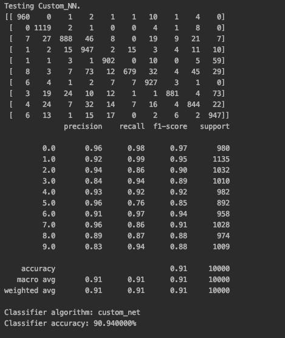
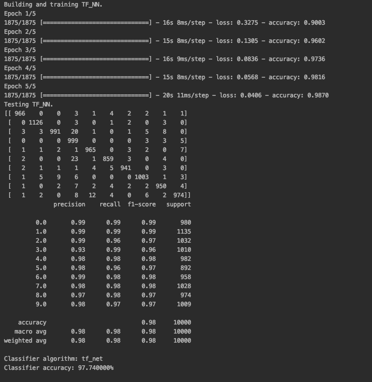

# NeuralClassification

 Yong Kai Dong
 
 Purdue Email
 
 https://github.com/YongDong11467/NeuralClassification
 
Resources: 
  - https://www.geeksforgeeks.org
  - https://scikit-learn.org/stable/modules/classes.html
  - https://www.tensorflow.org/api_docs/python/tf/keras

Completed:
  - Custom neural net
  - TF neural net
  - Pipeline & misc
  - Report
  
Custom neural net (90.94%)
  - Randomized weights are generated in the constructor
  - Trained using backpropagation with the sigmoid activation function. 
      - This is where the errors are minimalized and the weight are revised over and over
      - Used mini-batches of size 100 which servers to reduce the effect of outlier and increase speed
TF neural net (97.74%)
  - Built a 3 layer network with 784, 512, and 10 in the respective layers.
  - The first represent the a 28x28 image flatten to a array of 784 elements and the last layer represents 
    the possible outputs 0-9. (Same design as custom neural net)
  - Modify the yTraining data to support the expected input

Relevant outputs:

<table>
  <tr>
      <td></td>
      <td></td>
  </tr>
</table>
